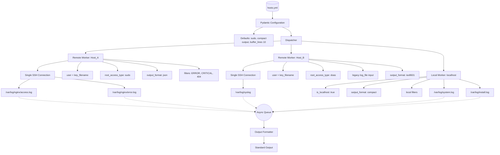

# a12rta - Another One to Rule Them All

[](https://github.com/xsub/a12rta/actions/workflows/ci.yml)
[](https://www.python.org/downloads/)
[](https://opensource.org/licenses/MIT)

`a12rta` is a small asynchronous log monitoring utility for watching local and remote log files from one process.

It uses byte-offset polling instead of spawning long-lived `tail -f` subprocesses. Remote logs are read over persistent `asyncssh` connections, with one SSH connection per host and multiple monitored files per connection. Local logs are read through native Python file I/O using the same offset-based model.

The current implementation focuses on low process overhead, predictable output, simple YAML configuration, regex-based client-side filtering, and graceful shutdown behavior.

## Features

- Asynchronous local and remote log polling
- One SSH connection per remote host, with multiple log files per host
- Byte-offset tracking with reads emitted only at newline boundaries
- Basic log truncation/rotation handling by resetting offsets
- Optional client-side regex filters
- Output formats: `compact`, `iso8601`, and `json`
- Backward-compatible `log_file` input for single-file host entries
- YAML configuration validated with Pydantic
- Graceful shutdown on `Ctrl+C` / `SIGTERM`
- Pytest-based CI on Python 3.11

## Architecture



## Configuration

`hosts.yml` is a list of local or remote log sources.

```yaml
- host: Host_A
  user: almalinux
  key_filename: ~/.ssh/id_rsa
  buffer_lines: 20
  root_access_type: sudo
  log_files:
    - /var/log/nginx/access.log
    - /var/log/nginx/error.log
  filters:
    - "ERROR"
    - "CRITICAL"
    - "404"
  output_format: json

- host: Host_B
  user: pablo
  key_filename: ~/.ssh/id_ed25519
  buffer_lines: 10
  root_access_type: doas
  log_file: /var/log/syslog
  filters:
    - "sshd"
    - "failed|error"
  output_format: iso8601

- host: localhost
  is_localhost: true
  buffer_lines: 5
  log_files:
    - /var/log/system.log
    - /var/log/install.log
  filters:
    - "kernel"
    - "panic|error"
  output_format: compact
```

`log_file` is accepted for backward compatibility and is converted internally to `log_files`, but new configuration should prefer the list form.

### Configuration Fields

| Field | Required | Description |
| :--- | :---: | :--- |
| `host` | yes | Remote host name, IP address, or `localhost`. |
| `user` | remote only | SSH username for remote hosts. |
| `is_localhost` | no | Forces local file polling without SSH. |
| `key_filename` | no | SSH private key path used by `asyncssh`. |
| `log_files` | yes | List of files to monitor. |
| `log_file` | no | Backward-compatible single-file form converted internally to `log_files`. |
| `buffer_lines` | no | Accepted configuration field with default `10`; retained for compatibility with earlier buffered-tail behavior. |
| `root_access_type` | no | Prefix used for remote read commands, usually `sudo` or `doas`. Defaults to `sudo`. |
| `filters` | no | List of regex patterns; matching lines are emitted. |
| `output_format` | no | One of `compact`, `iso8601`, or `json`. Defaults to `compact`. |

## Usage

Install runtime dependencies:

```bash
python3 -m pip install -r requirements.txt
```

Run with the default configuration file:

```bash
python3 a12rta.py
```

Run with an explicit configuration file:

```bash
python3 a12rta.py -f hosts.yml
```

## Output

Compact output:

```text
@2026-07-19 12:00:00 Host_A:/var/log/nginx/error.log:
example log line
-----
```

ISO-8601 output:

```text
[2026-07-19T12:00:00.000000] Host_A -> /var/log/nginx/error.log | example log line
```

JSON output:

```json
{"timestamp":"2026-07-19T12:00:00.000000","host":"Host_A","file":"/var/log/nginx/error.log","message":"example log line"}
```

## Implementation Notes

- Remote workers keep one `asyncssh` connection open per host.
- Each monitored file is polled by size and byte offset.
- Reads are capped to a fixed chunk size and only complete newline-terminated data is emitted.
- If a file shrinks, the offset is reset to handle truncation or rotation.
- Regex filters run on the client side after a complete line is decoded.
- The consumer owns formatting and writes records to standard output.

## Development

Install development dependencies:

```bash
python3 -m pip install -r requirements-dev.txt
```

Run the test suite:

```bash
python3 -m pytest -v
```

## Roadmap

- Harden remote shell quoting and sudo/doas policy assumptions.
- Add tests for remote polling, local polling, output formatting, and graceful shutdown.
- Add packaging metadata for the current `asyncssh` and Pydantic-based implementation.
- Consider a small authenticated web interface after the CLI behavior is stable.
