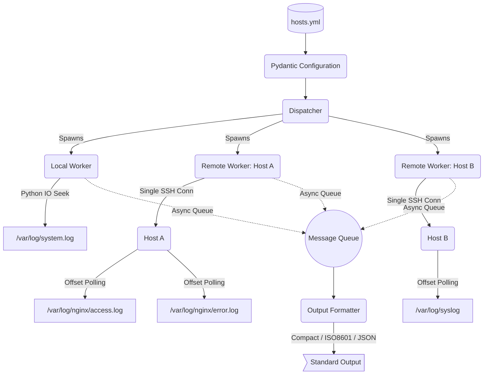

# a12rta - Another One to Rule Them All

[](https://github.com/xsub/a12rta/actions/workflows/ci.yml)
[](https://www.python.org/downloads/)
[](https://opensource.org/licenses/MIT)

A high-performance, asynchronous log monitoring utility for distributed infrastructure.

a12rta leverages a disciplined producer-consumer architecture to monitor local and remote logs without the process overhead of standard shell utilities. By using byte-offset polling over persistent SSH connections, it is designed for production environments where resource conservation and reliability are paramount.

### 🔥 Latest Update: Graceful Shutdown
a12rta now supports clean exit sequences. Press `Ctrl+C` to trigger a graceful shutdown—the main event loop cancels pending coroutines and closes SSH connections cleanly, ensuring no orphaned handles remain on your production nodes.

### Core Engineering Highlights
*   **Byte-Offset Polling Mechanism**: Instead of spawning expensive sub-processes (like `tail -f`), a12rta tracks the byte-offset of monitored files. It efficiently seeks to the end of the file and reads chunks, eliminating the process explosion common in monitoring tools.
*   **SSH Multiplexing**: Designed for massive scale; a single SSH connection serves as the transport for all monitored logs on a specific host. This significantly lowers CPU and network overhead.
*   **Safe Chunking**: The reader stops strictly at the last full newline (`\n`), ensuring you never receive truncated, incomplete log lines.
*   **Resilient Concurrency**: Built on `asyncio` and `asyncssh`, supporting auto-reconnect logic to recover from network jitters or remote node outages.
*   **Client-Side Filtering**: Integrated Regex-based error message filtering allows for immediate actionable alerts without server-side config changes.

### Architecture Overview


### Project Milestones

| Status | Feature | Implementation Detail |
| :---: | :--- | :--- |
| ✅ | Resilience | Async auto-reconnect logic for stable SSH pools. |
| ✅ | Multiplexing | Arbitrary number of logs monitored over one SSH connection. |
| ✅ | Local Mode | Native file streaming, bypassing SSH entirely for localhost. |
| ✅ | Configuration | Pydantic-based validation with sensible defaults. |
| ✅ | Output | Support for Compact, ISO8601, and JSON output formats. |
| ✅ | Filtering | Client-side Regex error message filtering. |
| ✅ | Optimization | Byte-offset polling using asyncssh. |
| ✅ | Licensing | Permissive licensing for open-source adoption. |

### Roadmap (TODOs)
*   [ ] **Web Interface**: Serve logs via a secured (TLS/SSL) mini-web-server for browser-based monitoring.
*   [ ] **Security hardening**: Transition from password-less sudo to strict sudoers.d policies.

### Configuration Example (hosts.yml)
```yaml
- host: Host_A
  user: almalinux
  key_filename: ~/.ssh/id_rsa
  login_timeout: 5
  log_file: /var/log/nginx/access.log
  delay: 5
  buffer_lines: 10
  root_access_type: sudo

- host: Host_C 
  user: pawel 
  key_filename: ~/.ssh/id_rsa
  login_timeout: 8 
  log_file: /var/log/authlog
  delay: 60
  buffer_lines: 5
  root_access_type: doas
```

### Sample Output
```shell
Connected to Host_A.
Connected to Host_C.

@2023-08-16 00:52:08.891383 Host_A:/var/log/nginx/access.log:
ANONYMIZED_IP - - [15/Aug/2023:21:21:21 +0000] "GET / HTTP/1.1" 200 19248 "-" "UserAgent123" "-"
-----
@2023-08-16 00:52:08.891527 Host_A:/var/log/nginx/access.log:
ANONYMIZED_IP - - [15/Aug/2023:21:56:22 +0000] "GET /owa/auth/x.js HTTP/1.1" 404 5780 "-" "UserAgentFinal1" "-"
-----
Ctrl+C received. Shutting down.
Main coroutine cancelled. Stopping the event loop.
```
